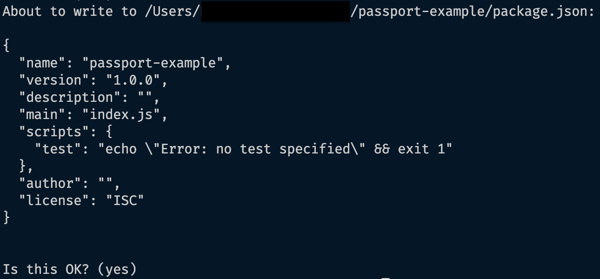
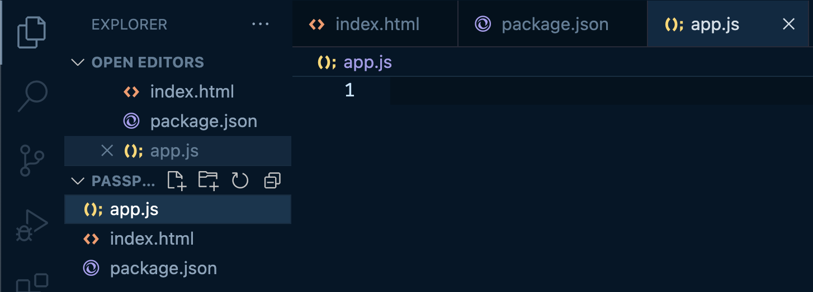

# Preliminary Setup

## Purpose Of Passport.js

>Before the installation process, you need to decide on the authentication strategy you want to implement first. The following instructions will guide you through the process of implementing the local [strategy](./glossary.md#strategies).

## Create A Project Folder

### 1.Project Folder Creation

The first thing you will need to do is create a folder for all of the files in this project. Choose a place in your computer that you would like to save your project. Create the folder.

### 2.Ensure Correct Folder In Your VSCode Terminal

In your VSCode terminal, navigate your way to the project folder you created.

!!! example "Command"

    Run the following command to navigate to your root folder.

    `cd ~`

    This command will list the folders directly inside the root folder.

    `ls`

    Choose the folder you wish to enter and run this command.

    `cd <chosen folder>`

    Repeat the last two commands in order until you reach the project folder.

    ??? success "Screenshot: Terminal Current Folder"

        We have used passport-example as a folder name.

         

## Installation and Configuration

### Purpose Of NPM Installation

>Prior to installation, initializing npm is necessary to start the process. With approximately 800,000 code packages, npm is the largest software registry available. It's also an open-source platform, meaning that it is free for all users.

??? question "Why do we start with `npm init`?"

    The command npm init is used to initialize a new npm project, which sets up the project's package.json file, while npm install is used to install the dependencies listed in the package.json file. 
    
    * Therefore, npm init is typically used first to establish the project's configuration before installing any dependencies.

### 1.Installing NPM

1.Initialize npm using the command terminal by running the following command:

!!! example "Command:"

    &nbsp;&nbsp;&nbsp;&nbsp;`npm init`

Once your terminal finishes downloading. Hit enter to begin structuring your json file.

You will be prompted in your terminal with a few questions. For the sake of this documentation we will hit enter until our terminal is once again displaying the file we are currently working in.

??? success "Screenshot: Terminal JSON File Creation"

     

    We are using a folder called passport-example.

     

??? note "Updating JSON File"

    You can change this information later on inside the package.json file.

When using npm, it generates a package.json file that keeps track of all the libraries and modules utilized in your project. This feature is beneficial as it allows others to gain an understanding of what your project is reliant on, and helps to monitor which program versions are required for proper operation.

Next, install the libraries you will need to complete this project. These libraries are passport, passport-local, express, express-sessions, and nodemon.

2.To install passport.js to your local VSCode, with npm, use the following command:

!!! example "Windows:"

    &nbsp;&nbsp;&nbsp;&nbsp;`$ npm install passport passport-local express express-sessions nodemon`

!!! example "MacOs:"

    &nbsp;&nbsp;&nbsp;&nbsp;`npm install passport passport-local express express-sessions nodemon`

Running this command will install the [libraries](./glossary.md#library) you need for the project. These files will be inside a folder called node_modules that is automatically created when you run these commands. To confirm that your files have been downloaded correctly you can check in the package.json file.

[Nodemon](./glossary.md#nodemon) facilitates fast Node.js app development by automatically restarting the application upon detecting changes in the project directory.

??? success "Screenshot: Successful Library Installation"

     

These errors and warnings do not affect your ability to work with these libraries.

## Setting Up Your Express Application

>### Purpose Of Express
>
>To integrate Passport.js into your project, it's necessary to establish an express application first, as Passport.js is tailored exclusively for express applications. Trying to implement passport.js without using express will create a number of edge cases that may cause issues with your program running successfully.

In this section we will teach you how top create your index.html file and app.js file. The html file will hold your login form. The javascript file will be home to all of the functionality.

### Create An HTML Form

#### 1.Create An HTML File

This will be the file that contains your form. This file must be inside your project folder.

??? note "Naming Your File"

    This file can be named whatever you would like however we will be referring to it as index.html

??? success "Screenshot: HTML File Creation"

     

#### 2.Structure Your HTML Document

This HTML starter code allows the browser that runs this file to understand and interpret any code you write in this document.

??? note "Understanding HTML Basics"

    Make sure you understand the topic of HTML file structures before proceeding.

    We have provided you with some helpful documentation below:

    &nbsp;&nbsp;&nbsp;&nbsp;[HTML Documentation](https://www.w3schools.com/html/)

!!! example "HTML File"

    Copy and paste the code below or look at the tip below for a shortcut.

        ```html
        <!DOCTYPE html>
        <html lang="en">
          <head>
            <meta charset="UTF-8">
            <meta http-equiv="X-UA-Compatible" content="IE=edge">
            <meta name="viewport" content="width=device-width, initial-scale=1.0">
            <title>Document</title>
          </head>
          <body>
            // Insert form here later
          </body>
        </html>
        ```

??? tip "Tip: Setting Your HTML Template"

    There is a VSCode shortcut that will set your template.

    &nbsp;&nbsp;&nbsp;&nbsp;++exclam+enter++

??? success "Screenshot: HTML Document Template"

       

#### 3.Create An HTML Form

This form will contain the input boxes for the user. inside the body portion of your index.html file paste this form. It is a basic form that has a username and password as well as buttons for both logging in and out.

!!! example "HTML Form"

    You can copy and paste this html form into the stated part of the body in your html file.

    ```html
        <form method="post" action="/login">
          <label for="username">Username:</label><br>
          <input type="text" id="username" name="username"><br>
          <label for="password">Password:</label><br>
          <input type="text" id="password" name="password"><br><br>
          <input type="submit" value="Log In">
        </form>
        <form method="get" action="/logout">
            <input type="submit" value="Log Out">
        </form>
    ```

??? note "Advanced Users"

    You can customize your form later but for this demonstration we will be covering the basics.

    Some features you may consider are:

    * Hide the logout button while users are not logged in and hide the login while users are logged in.

    * CSS and designing an aesthetically appealing form.

??? success "Screenshot: HTML Form"

    Your html file should now look like this.

    

You will need to create a route for the login but we will explain more about that on the next page.

#### 4.Create Login/Logout Button

In the html form we have included a logout button. For functionality you will need to create a route for each. We will discuss this on the next page. Just understand that your buttons will not work for now.

??? note "Logout Button"

    There are 4 important steps to create a functional logout button.

    &nbsp;&nbsp;&nbsp;&nbsp;1.Reference the logout button.

    &nbsp;&nbsp;&nbsp;&nbsp;2.Enable the button for logged in users.

    &nbsp;&nbsp;&nbsp;&nbsp;3.Create the logout function.

    &nbsp;&nbsp;&nbsp;&nbsp;4.Create an event listener for the button to work when clicked on.

    If you are not familiar with logout buttons revisit the topic and then return here.

    Here is a helpful resource on the topic of logout buttons:

    &nbsp;&nbsp;&nbsp;&nbsp;[Logout Buttons](https://userfront.com/guide/build-logout-button-html)

### Create The Javascript File

#### 1.Create A New Javascript File

We need to create a Javascript file to add all of the routes and functionality of the login. Without this we would only be able to see the html form but not use it.

!!! warning "File Location"

    This file must be inside your project folder. If it is not within the correct folders your routes may not work.

??? tip "Naming Your File"

    This file can be named whatever you would like however we will be referring to it as app.js.

??? success "Screenshot: Javascript File Created"

    Your file tabs should look similar to this.

    

#### 2.Insert Code

The code snippet we have provided below can be inserted into the app.js file and will provide the foundation of your express application. This includes your server setup.

!!! example "Express Application & Server Code"

    ```js
      const express = require("express");
      const bodyParser = require("body-parser")
      const session = require("express-session")
      const path = require("path");
      const passport = require("./passport");

      const port = process.env.port || 8000;

      const app = express();

      app.use(bodyParser.urlencoded({ extended: false }));
      app.use(session({
          secret: 'keyboard cat',
          resave: false,
          saveUninitialized: true,
          // cookie: { secure: true }
          // To run this on localhost you must keep this commented out.
          // For any user(s) planning on using this for an application using https, uncomment the cookie line of code above.
      }))

      // app.use(passport.initialize())
      // app.use(passport.session())

      app.get("/", (req, res) => {
          res.sendFile(path.join(__dirname, '/index.html'));
      })

      app.get("/fail", (req, res) => {
          console.log(req.session.messages);
          res.send("Failure to Log In.");
      })

      // app.post("/login", passport.authenticate("local", {
      //     successRedirect: "/",
      //     failureRedirect: "/fail",
      //     failureMessage: true
      // }))

      // app.get("/logout", (req, res) => {
      //     req.logout((err) => {
      //         if(err) {
      //             console.log(err);
      //         }
      //     })
      //     res.redirect("/");
      // })

      app.listen(port, () => {
          console.log(`Server has started on port ${port}`);
      });
    ```

This will be how your VSCode can send your application to the browser when localhost:8000 is running.

??? tip "Advanced Users"

    For more advanced users, separate your code blocks into an app.js file and have your server code in a separate file called server.js.

    This will make for cleaner code but for now we will keep our instructions lean.

## Starting Up Your Express Server

### Local Browser

Here you will learn how to run your program locally using your localhost.

#### 1.Script Command

Find the script in your package.json file and that will be how you command the terminal to run your application. You may change this to a command such as nodemon app.js.

Initially, a script will be provided from the installation of libraries. Change this to nodemon app.js. Now you will be able to run this command in your VSCode terminal to launch the project in your local browser.

!!! note "Note: Open package.json and add change script to start your express application"

??? success "Screenshot: Package.JSON- Starter Script"

      

As you can see we have added a comma and then some code into the package.json.

Replace your code with the following.

!!! example "Package.json"

    ```json
    {
      "name": "passport-example",
      "version": "1.0.0",
      "description": "",
      "main": "index.js",
      "scripts": {
        "test": "echo \"Error: no test specified\" && exit 1",
        "dev": "nodemon app.js"
      },
      "author": "",
      "license": "ISC"
    }
    ```

??? note "Script Command"

    Notice the dev value in the code block. 

    `nodemon.js`

    This is how you will run your code in the VSCode terminal.

#### 2.Run Script To Start Server

Remember when we installed nodemon? This is why we installed it.

When you run your script, 'nodemon app.js', your program will run on the chosen localhost port. Nodemon will also make sure that your code updates and continues to run rather than having to run a script after any updates.

Now, run the script in your command terminal to start the server.

You will now be able to see your program when you open localhost:8000. Localhost number is the port number declared in your app.js file.

??? success "Screenshot: Port URL"

      

??? success "Example: Port Listener"

    This code is at the top of your app.js.

    

    This code is at the bottom of your app.js.

    

#### 3.Run Local Browser

Currently, we have all of the passport.js code commented out. This is because we have not yet set up passport configuration, a database(Including methods), or the routes.

Run the URL localhost:8000 in your browser and you will see your application displayed.

??? question "Why do we use localhost:8000?"

    We are using 8000 but you may choose your own as long as you use it throughout your entire application.

Your HTML will be what is displayed in your browser window.

??? success "Screenshot: Browser URL & Form"

    

## Conclusion

By the end of this you will have successfully installed all software and setup the basics of your express app: index.html, app.js, and an updated script inside your package.json file.

??? success "Congratulations"

    You have successfully completed your preliminary setup for implementing passport.js.

[Next Page: Strategies](https://breadscorner.github.io/Passport.js-LocalStrategyUserDocumentation/strategies)
