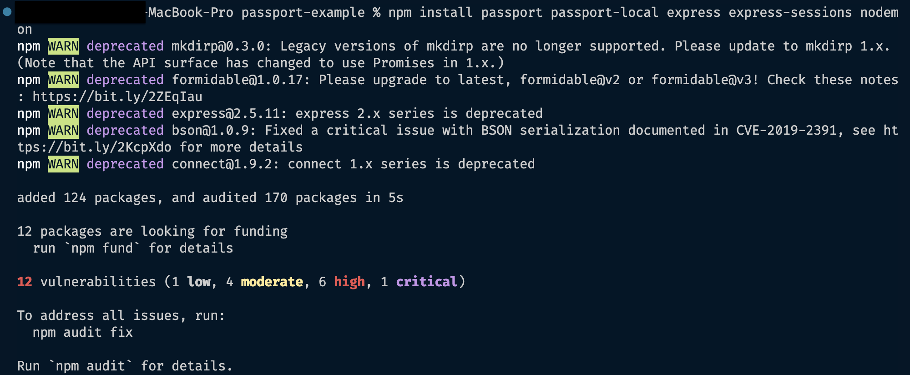

# Preliminary Setup

## Purpose Of Passport.js

Before the installation process, you need to decide on the authentication strategy you want to implement first. The following instructions will guide you through the process of implementing the local strategy.

## Installation and Configuration

>### Purpose Of NPM Installation
>
>Prior to installation, initializing npm is necessary to start the process. With approximately 800,000 code packages, npm is the largest software registry available. It's also an open-source platform, meaning that it is free for all users.

### 1.Installing NPM

1.Initialize npm using the command terminal by running the following command:

!!! example "Command:"

    &nbsp;&nbsp;&nbsp;&nbsp;`npm init`

Once your terminal finishes downloading. Hit enter to begin structuring your json file.

You will be prompted in your terminal with a few questions. For the sake of this documentation we will hit enter until our terminal is once again displaying the file we are currently working in.

???+ success "Screenshot: Terminal JSON File Creation"

     
     

???+ note "Updating JSON File"

    You can change this information later on inside the package.json file.

When using npm, it generates a package.json file that keeps track of all the libraries and modules utilized in your project. This feature is beneficial as it allows others to gain an understanding of what your project is reliant on, and helps to monitor which program versions are required for proper operation.

Next, install the libraries you will need to complete this project. These libraries are passport, passport-local, express, express-sessions, and nodemon.

2.To install passport.js to your local VSCode, with npm, use the following command:

!!! example "Windows:"

    &nbsp;&nbsp;&nbsp;&nbsp;`$ npm install passport passport-local express express-sessions nodemon`

!!! example "MacOs:"

    &nbsp;&nbsp;&nbsp;&nbsp;`npm install passport passport-local express express-sessions nodemon`

Running this command will install the [libraries](./glossary.md#library) you need for the project. These files will be inside a folder called node_modules that is automatically created when you run these commands. To confirm that your files have been downloaded correctly you can check in the package.json file.

[Nodemon](./glossary.md#nodemon) facilitates fast Node.js app development by automatically restarting the application upon detecting changes in the project directory.

???+ success "Screenshot: Successful Library Installation"

     

## Setting Up Your Express Application

>### Purpose Of Express
>
>To integrate Passport.js into your project, it's necessary to establish an express application first, as Passport.js is tailored exclusively for express applications. Trying to implement passport.js without using express will create a number of edge cases that may cause issues with your program running successfully.

In this section we will teach you how top create your index.html file and app.js file.

### Create An HTML Form

#### 1.Create An HTML File

This will be the file that contains your form. This file must be inside your project folder.

???+ note "Naming Your File"

    This file can be named whatever you would like however we will be referring to it as index.html

???+ success "Screenshot: HTML File Creation"

     

#### 2.Structure Your HTML Document

This HTML starter code allows the browser that runs this file to understand and interpret any code you write in this document.

???+ note "Understanding HTML Basics"

    Make sure you understand the topic of HTML file structures before proceeding.

    We have provided you with some helpful documentation below:

    &nbsp;&nbsp;&nbsp;&nbsp;[HTML Documentation](https://www.w3schools.com/html/)

Copy and paste the code below or look at the tip for a shortcut.

```html
<!DOCTYPE html>
<html lang="en">
  <head>
    <meta charset="UTF-8">
    <meta http-equiv="X-UA-Compatible" content="IE=edge">
    <meta name="viewport" content="width=device-width, initial-scale=1.0">
    <title>Document</title>
  </head>
  <body>
  </body>
</html>
```

???+ tip "Setting Your HTML Template"

    There is a VSCode shortcut that will set your template.

    &nbsp;&nbsp;&nbsp;&nbsp;++exclam+enter++

???+ success "Screenshot: HTML Document Template"

       

#### 3.Create An HTML Form

This form will contain the input boxes for the user.

!!! example "Example: HTML Form"
<!-- screenshot of form -->

<!-- needs input for username and password also a submit button -->
<!-- can break down individual steps for form creation -->

#### 4.Create Logout Button

In the html form add a logout button.

???+ note "Logout Button"

    There are 4 important steps to create a functional logout button.

    &nbsp;&nbsp;&nbsp;&nbsp;1.Reference the logout button.

    &nbsp;&nbsp;&nbsp;&nbsp;2.Enable the button for logged in users.

    &nbsp;&nbsp;&nbsp;&nbsp;3.Create the logout function.

    &nbsp;&nbsp;&nbsp;&nbsp;4.Create an event listener for the button to work when clicked on.

    If you are not familiar with logout buttons revisit the topic and then return here.

    Here is a helpful resource on the topic of logout buttons:

    &nbsp;&nbsp;&nbsp;&nbsp;[Logout Buttons](https://userfront.com/guide/build-logout-button-html)

### Create The Javascript File

#### 1.Create A New Javascript File

!!! note "File Location"

    This file must be inside your project folder.

???+ tip "Naming Your File"

    This file can be named whatever you would like however we will be referring to it as app.js.

???+ success "Screenshot: Javascript File Created"

    

#### 2.Insert Code

The code snippet we have provided below can be inserted into the file and will provide the foundation of your express application.

???+ example "Example: Express Application Code"

The code block below will setup your server. This will be how your VSCode can send your code to the browser using localhost.

???+ example "Example: Server Information Code"

???+ tip "Advanced Users"

    For more advanced users, separate your code blocks into an app.js file and have your server code in a separate file called server.js.

<!-- add sessions here -->

## Starting Up Your Express Server

### Local Browser

Here you will learn how to run your program locally using your localhost.

#### 1.Script Command

Find the script in your package.json file and that will be how you command the terminal to run your application. You may change this to a command such as nodemon app.js.

!!! note "Note: Open package.json and add a script to start your express application"

<!-- screenshot of the package.json with the start -->
???+ example "Example: Package.JSON- Starter Script"
<!-- include feedback statement explaining how the script works -->
  <!-- One statement that equals the whole command to run the project -->

#### 2.Run Script To Start Server

Run the script in your command terminal to start the server.

You will now be able to see your program when you open localhost:8000. Localhost number is the port number declared in your app.js file.

???+ example "Example: Package.JSON- Port"
<!-- screenshot of the port number in app.js -->

???+ example "Example: Port Listener"

#### 3.Run Local Browser

Run the URL localhost:8000 in your browser and you will see your application displayed.

???+ question "Why Localhost:8000?"

    We are using 8000 but you may choose your own as long as you use it throughout your entire application.

Your HTML will be what is displayed in your browser window.

???+ example "Example: Browser URL"
<!-- screenshot of browser with inputs -->

## Conclusion

By the end of this you will have successfully installed all software and setup the basics of your express app: index.html, app.js, and an updated script inside your package.json file.

!!! success
<!-- What success looks like at each step(Screenshots of terminal) -->

[Next Page: Strategies](/strategies)
