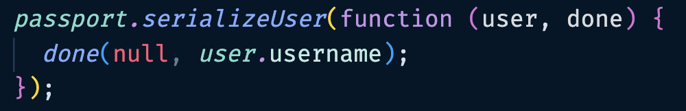

# Routes

## What Are Routes?

In Passport.js, a route is a protected [endpoint](./glossary.md#endpoint) that requires authentication. Passport [middleware](./glossary.md#middleware) checks if the user is authenticated and redirects them to the login page or sends an error response if not. Each route is associated with an authentication strategy, like local or social authentication. Passport.js lets developers configure authentication strategies for each route to ensure only authenticated users access protected resources.

## Import From Passport.js

!!! warning "Important"

    For the following instructions make sure that you are working inside of your app.js file.

### 1. Require passport from passport.js

This imports our modified passport module, which contains our local login strategy that we are exporting from inside of passport.js. Uncomment the following lines of code to allow passport.js to be used in your application.

!!! example "Code: Uncomment"

    ```js
    const passport = require("./passport");
    ```

### 2. Use app.use() to initialize passport

Right now we have the following code commented out. We will need to uncomment them to allow the application to use passport.js.

!!! example "Code: Uncomment"

    ```js
    app.use(passport.initialize());
    ```

This initializes passport so the application understands that we are using it.

### 3. Connect Passport To Sessions

Right now we have the following code commented out. We will need to uncomment them to allow the application to use passport.js.

!!! example "Code: Uncomment"

    ```js
    app.use(passport.session());
    ```

By adding this line of code to the top of app.js we can ensure that passport connects to [sessions](./glossary.md/sessions) so that we are storing the user information properly when we call the serializeUser function.

???+ success "Middleware"

    The top of your app.js should look like this screenshot.

    

By completing these steps, we now automatically have access to 2 important functions that exist within passport:

!!! example "Functions"

    ```js
      passport.authenticate()
      req.logout()
    ```

## Using Passport Functions Inside Routes

[Routes](./glossary.md#routes) are what allow you to control what happens when users enter URLs associated with your website. For example, "localhost:3000/" requires you to have a route for "/", while "localhost:3000/users" requires you to have a route for "/users". Users cannot access webpages that do not have routes leading towards them. As we are using the Express module for handling our routes, we will be using app.get and app.post to initialize our routes.

To read further on Express routes, [refer to this document](https://expressjs.com/en/guide/routing.html).

<!-- explain routes briefly and include a link for further reading -->

### 1. Create A GET Route

Creating a get route will allow you to access the form.

!!! example "Code"

    ```js
      app.get("/", (req, res) => {
        res.sendFile(path.join(__dirname, '/index.html'));
      })
    ```

By doing this, when users access your website's homepage, your app will recognize the route and know to respond by sending the index.html file to the user's browser. This is what allows users to see your website's homepage.

### 2. Create a POST route for when the user clicks the button to submit the form

!!! example "Code: Uncomment"

    ```js
      app.post("/login") {
        // Login logic goes here
      }
    ```

Here, rather than using app.get, we use app.post, because that is the method that we defined in our HTML form. As well, we use the "/login" route, because that is the action we defined in our HTML form. Therefore, when a user clicks the submit button on that form, they will activate this route.

???+ warning "Route Types"

    If you need further clarification about post and get routes please read this documentation before proceeding.

    [Route Types](https://expressjs.com/en/guide/routing.html)

### 3. Complete Login Route

Insert passport.authenticate into the POST "/login" route.

!!! example "Code"

    ```js
    app.post("/login", passport.authenticate("local", {
        successRedirect: "/",
        failureRedirect: "/fail",
        failureMessage: true,
    }))
    ```

There are five parts to what we have done.  

* Passport.authenticate is a callback function that takes what the user has placed in the username and password fields, and then runs it through our passport module.  

* "local" tells passport to use the local strategy we have configured.  

* successRedirect means that if the username and password combination is valid, the user will be redirected to the "/" route.  

* failureRedirect means that if the username and password combination is invalid, the user will be redirected to the "/fail" route, which will inform the user that login failed.  

* Finally, failureMessage is set to "true", meaning that on a failure to validate this user, a message will be stored in req.session.messages for the server to use.  

### 4. Create a logout route and enable the logout using req.logout()

!!! example "Code"

    ```js
    app.get("/logout", (req, res) => {
        req.logout((err) => {
          console.log(err);
        })
        res.redirect("/");
    })
    ```

Here, we manage what happens when the user clicks the 'Logout' button. When req.logout(), a function that belongs to the passport library, is activated, the user session that a successful passport.authenticate() creates is destroyed. Because of this, the user will no longer have their username stored inside their browser's session. After this is performed successfully, res.redirect() will redirect the user to the "/" route.

## Passport.authenticate
<!-- Armaan double check please -->

There is a lot that happens inside passport.authenticate().

When passport.authenticate() is run, it looks at the request that is sent to it. Specifically, it looks for something that matches the username and password that it requires to run a function. In this case, this would be username and password that we have passed to it through the HTML form, which will take the form req.body.username and req.body.password.

???+ example "HTML Form"

    

<!-- admonition -->
Note: They are called req.body.username and req.body.password because that's what we named the fields in our HTML, using name="username" and name="password".

Once it takes the username and password, these are placed into the function we made to check if there is a user that has both that username and password. That function will either return a user or it will return false, and this value will be placed into a variable.

???+ example "Fake-DB Function"

    

The variable is then used as a condition in an if statement. If the variable contains a user's information, we will run done(null, user). This function sends the variable into passport.serializeUser, which runs another done function: done(null, user.username).

???+ example "serializeUser Function"

    

This function first creates a session that contains the user's username. Now, this session can be access in your routes as req.user. After that, it activates the successRedirect of passport.authenticate(), leading the user to a new webpage.

???+ warning "Sessions Storing"

    If you are not comfortable with storing sessions read the documentation and return to this step.

    [Sessions Storage](https://www.freecodecamp.org/news/how-web-storage-works/#:~:text=Session%20storage%20allows%20you%20to,data%20stored%20in%20session%20storage.)

???+ example "Route Redirects"

    

???+ danger "Variable Equals False"

    If the variable contains false, the program will run the following code:
    
    ```js
    done(null, false, {message: "Your login details are not valid. Please try again."})
    ```

This activates the failureRedirect of passport.authenticate(), leading the user to a new webpage. As well, if failureRedirect is true, the message "Your login details are not valid. Please try again." will be saved in req.session.messages.

## Verify Successful Authentication

To see if your passport.authenticate was successful or not, you can inspect the webpage.

&nbsp;&nbsp;&nbsp;&nbsp;1.To complete this task go to the Storage tab at the top of the browser.

&nbsp;&nbsp;&nbsp;&nbsp;2.Click on Cookies.

&nbsp;&nbsp;&nbsp;&nbsp;3.If there is a session stored there, then that means your passport.authenticate() and passport.serializeUser() were successful.

!!! success "Sessions"

    

## Conclusion

Now that you have completed these instructions you have the ability to:

* Create an express.js website that can authenticate users using your own modified version of the passport.js library.

* Store the user's data in sessions using the express-sessions library.

* Verify that your authentication was successful by inspecting the browser webpage.

By the end of this, you will have created an Express website that authenticates users using your own modified version of the passport.js library, before storing the user's data in as a session using the express-session library.

!!! success "Congratulations"

    You have learned how to implement passport.js into your express application.

[Next Page: Troubleshooting](/trouble)
