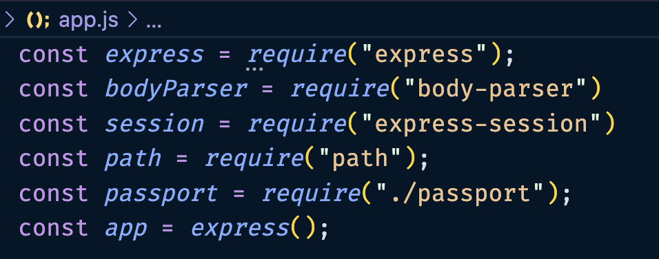

# Strategies

## Set Up A Database

For the purpose of this project we will be creating a fake database.

??? tip "Advanced Users"

    You can read documentation on the implementation of a real database, such as MySQL or MongoDB. You can swap out the fake database for a real one by following the documentation for those languages and technologies.

    [Database Implementation](https://blog.devart.com/how-to-connect-to-mysql-server.html)

### 1.Create A File

This file will be named fake-db.js.

Inside this file we will create an array containing objects. Each object will contain a username and password.

### 2.Create a Variable

Inside the fake-db.js you will create a variable.

This will contain a fake database of users and passwords that you can access for the purposes of user authentication.

??? example "Fake Database"

    ```js
      const users = [
        {
          username: "Gary", 
          password: "gg"
        },
        {
          username: "Brett", 
          password: "bb" 
        }
      ]
    ```

### 3.Create & Export Functions

* For getting the user by the username or password.

* For finding the user by the username.

Both of these functions will return the entire object(username and password) associated with the requested user.

!!! example "Example: "

    Add this block of code, containing the first function, below the users variable.

    ```js
      const getUserByUsername = (username) => {
        let user;
        users.forEach(u => {
          if (u.username == username) {
            user = u;
          }
        })
        return user;
      }
    ```

    This function returns all the data that we have for a user that matches the username.

!!! example "Example: "

    Paste this function below the getUserByUsername function.

    ```js
      const getUserByUsernameAndPassword = (username, password) => {
        let user = false;
        users.forEach(u => {
          if (u.username == username) {
            if (u.password == password) {
              user = u;
            }
          }
        })
        return user;
      }
    ```
    This function returns all the data that we have for a user that matches the username and password.

???+ tip "External Databases"

    If using another database you would code the functions differently, but result of these functions remain the same in that they must return an object.

### 4.Export Functions

This will allow you to access your database by importing the functions that query the database.

!!! example "Export The Functions"

    Add this block to the bottom of your fake-db.js. 

    ```js
      module.exports = {
        getUserByUsername,
        getUserByUsernameAndPassword
      }
    ```

    This is how we export the functions to be used in our other files. You will need to import these functions into the files where they are used.

## Setting Up Passport.js

In this section you will be setting up passport so that you can use it in your app to authenticate users.

### 1.Create A File Named Passport.js

Create this file in the project folder. In this file you will be configuring passport for usage.

### 2.Import Libraries & Files

The libraries you will bring in will be:

* Passport library
* Local passport strategy
* Functions you made for querying your database in fake-db.js.

In app.js, you need to import all the files and libraries that you will be using.

!!! example "Importing Files & Libraries"

    Paste these at the top of your app.js.

    ```js
      const express = require("express");
      const bodyParser = require("body-parser")
      const session = require("express-session")
      const path = require("path");
      const passport = require("./passport");
      const app = express();
    ```

??? success "Screenshot: App.js Imports"

    This is how the top of your app.js file should look.

    

### 3.Create A Local-Strategy Variable

To configure local strategy for authentication, you must specify the authentication criteria and define the authorization process.

* This involves passing the username and password through a function and using the result to query a mock database.

!!! example "Example: "

    ```js
      const localStrategy = new LocalStrategy(
        (username, password, done) => {
          const user = getUserByUsernameAndPassword(username, password);
          if(user) {
            done(null, user)
          } else {
            done(null, false, {
              message: "Your login details are not valid. Please try again."
            })
          }
        }
      );
    ```
<!-- explain the code below -->
<!-- annotated code block with explanations on each line -->

<!-- Make more concise -->
The function will return a value that is either the user or undefined. This is used as the condition inside an if-statement.

If the value is a user, you run the function done(null, user). Null indicates that there are no errors, and user tells done() to run passport's serializeUser() function.

If the value is false, you run the function done(null, false, {message: ""}). Null indicates that there are no errors, and false tells done 'NOT' to run passport's login function. Instead, it will store the message inside your console's [session](./glossary.md#sessions).

### 4.Create serializeUser Function

This function stores the successfully logged in user's id into the browser's session. In this case, the user's id will be their username, but normally, it should be a piece of data about the user that is unique and cannot be changed.

!!! example "Function: serializeUser()"

    Paste this into your passport.js below localStrategy().

    ```js
      passport.serializeUser(function (user, done) {
        done(null, user.username);
      });
    ```

### 5.Create deserializeUser Function

In this function the information that the done function inside the serializeUser function takes, which is the user's username, is used in deserializeUser. We use the getUserByUsername() function from our fake-db.js to query for the user based off of their username. The returned value from that function is stored inside the variable 'user'.

!!! example "Function: deserializeUser()"

    Paste this code below your serializeUser() function.

    ```js
      passport.deserializeUser(function (username, done) {
        let user = getUserByUsername(username);
        if (user) {
          done(null, user);
        } else {
          done({ message: "User not found" }, null);
        }
      });
    ```

If the 'user' variable contains a value, indicating that getUserByUsername was successful, we run done(null, user). This done function puts the user object inside req.user, which can be accessed for a future usage.

If the 'user variable contains undefined, we run done({message: ""}, null), where the message is sent to the servers console(VSCode console) to tell the user that the function failed to retrieve a matching user with the requested username.

<!-- (Gary) put a pic if we can produce this error -->

## Export Local Login

You need to tell passport that you want to use the local strategy and that you want to export passport so that it can be used in app.js.

### 1.Add Code To Export Module

Add a line of code to the bottom of passport.js.

!!! example "Export Local Strategy"

    ```js
      module.exports = passport.use(localStrategy);
    ```

??? success "Export Local Strategy"

    This is what the bottom of your passport.js should look like.

    

By running this you modify the passport library to use your local login strategy. Because of this, you can now export your modified passport to app.js.

## Conclusion

On this page we learned about setting up the local strategy for passport.js. Move on to the next page to learn about implementing passport.js.

!!! success "Congratulations"

    You have successfully set up the local strategy, database, and functions to authenticate users.

[Next Page: Routes](https://breadscorner.github.io/Passport.js-LocalStrategyUserDocumentation/routes)
